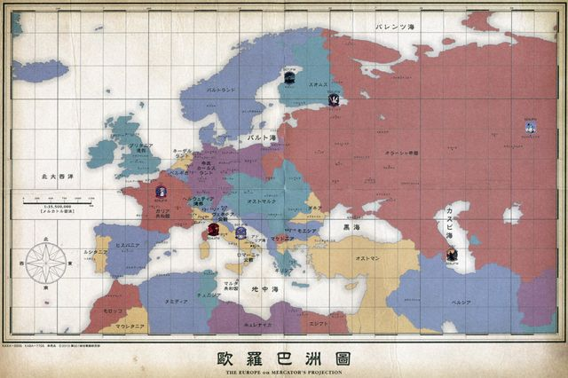

# Turn 1, January 1946: Planning

You are in command of the `Berlin Hive`, leading what's left of the European Neuroi. Which isn't much right now, all things considered. Ostmark fell a couple weeks ago, and you're barely holding the humans back at the Rhine.  
For the moment you don't have to worry about the Eastern front. Orussia's sending most of its forces to retake Vladivastok, but if either of your fellow Hives fall, you can expect the hammer to come down on you hard very, very quickly.  
And of course, the lazy Atlantics are, for the moment, doing absolutely nothing! You might want to see if they could give you a hand, or at the very least, draw some attention.

But for now, you have your objectives: gather `Ambient Energy` from this life-filled world, capture and study the human known as Yoshika Miyafuji, and possibly her squadron, and destroy the human race.  
The stubborn, warlike, determined, unyielding, and brave human race.

####Resources (RU): `10,000`
####Income: `1,000` per turn
####Units:
0. `50` Infantry Bot Divisions (Very Strong vs infantry, weak vs anything else, good at garrison and urban warfare) (Costs `10` RU)
0. `20` Neuroi Walker Groups (Strong vs Tanks, Infantry, Decent vs Air units, Weak vs witches and Artillery) (Costs `25` RU)
0. `40` Small Type Flyer groups (Strong vs bombers, decent vs fighters and lightly armoured ground units, Very weak vs AA and Witches) (Costs `20` RU)
0. `20` Medium Type Groups (Strong vs most ground units, weak vs fighters, Very Weak vs Witches) (Costs `30` RU)
0. `10` Large Type Groups (Strong vs most units, Decent vs Witches, few in number) (Costs `50` RU)
0. `5` Ultra-Heavy Groups (Very Strong vs all ground units, weak vs bombers, very few in number, big and obvious targets) (Costs `100` RU)

At the moment, the Neuroi are in control of Karlsland (the purple country). At least the parts of it that are east of the Rhine River.
Humans are all around you, though the Eastern front is at least relatively safe.

###Actions:  
- []  
- []

####Proposed actions:
- *Reconnaissance:* You know that the humans will attack soon, but you don't know from where. Sending out some aerial units might help you get a better idea.  
*Rewards:* Knowledge of human attack plan.
- *Defensive build-up:* You need fortifications, fast. The humans won't wait. Fortify Karlsland as much as possible in the amount of time you have.  
*Rewards:* Enhanced defences in Karlsland.
- *Atlantic Assistance:* The Atlantic Hive's been doing nothing for this whole war, surely they'll lend a hand now, with you on the brink of defeat?  
*Rewards: *Atlantic Hive Surfaces and attacks the Allies. Possible reinforcements.
- *Write in:* Anything you can think of doing, from raiding, to diplomacy, to a surprise counter-attack to building more units. Note that you need to spend an action to recruit units.  
*Rewards:* ???

###Research Actions:  
- []  
- []  
- []  

####Proposed Research Actions
- *Witch Capture unit:* If you're going to be taking Yoshika Miyafuji for study, you probably need a way to capture humans alive.
- *Neuroi water adaptation:* The Neuroi don't do well in, or above water, maybe you can change that?
- *Enhanced Targeting:* Since this war began, Witches and skilled fighter pilots have shown the ability to dodge Neuroi lasers with surprising ease. Remedy this.
- *Neuroi Espionage*: The Neuroi's main approach to humans has been, "when in doubt, laser to death". This approach clearly isn't working, perhaps a more subversive strategy is needed?
- *Neuroi Witch:* Attempts to create artificial witches to serve the Neuroi have failed miserably in the past. Almost all subjects attempted to defect to the humans. Perhaps couple hundredth times the charm?
- *Write in:* Any idea you might have, propose it, and we'll see where it goes.
