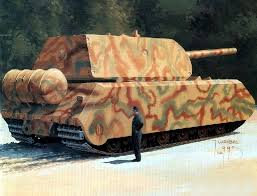
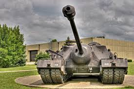

# Turn 1, January 1945: Results

###Actions

- **Reconnaissance:** You know that the humans will attack soon, but you don't know from where. Sending out some aerial units might help you get a better idea. Spend `1000 RU.` 
You quickly spend far more resources than any normal recon mission ever demands, using the massive input to produce a small fleet of stealthed, fast, and very impressive spying vessels. Sending them out across Europe, you learn that large portions of the Karlsland navy has moved into the Baltic, resting in ports in Northern Baltland and Suomos. Among these ships are several new H-Class Battleships and two Graf Zepplin Class Aircraft Carriers.  
In the west, there if a massive build-up along the Rhine River, with huge amounts of tanks, witches, and planes coming in every day. Your Spy Craft also detect some new vehicles, images being brought up now.  

  
**Reward:** Special Action unlocked, see below. Human attack focused on the Rhine River and Baltic Coast. Bonus to Defence Construction in Karlsland.

- **Defensive build-up:** You need fortifications, fast. The humans won't wait. Fortify Karlsland as much as possible in the amount of time you have. Spend `1000 RU`  
Karlsland turns into a fortress practically overnight. Anti air emplacements cover ever area, locations across the Rhine are locked down with turrets, bunkers, and heavy weapons. Along the Baltic, massive laser cannons capable of tearing apart battleships dot the landscape. It's not Vladivastok, but any invaders had better be willing to sustain massive casualties.  
**Reward:** Karlsland heavily fortified. Bonus to rolls on defence in Karlsland.

###Research Actions  
- **Neuroi Espionage:** The Neuroi's main approach to humans has been, "when in doubt, laser to death". This approach clearly isn't working, perhaps a more subversive strategy is needed? `Spend 1000 RU.`  
The old approach of Brute Force has reduced the Neuroi to a handful of Hives, all but one of which are under attack. You decide a more subtle approach might yield better results. After several days of brainstorming, you've created a new type of Neuroi. Just the size of an insect at its largest, the Infiltrator Class can move into human bases and observe their plans and strategies. You've already begun to think of ways to put it to use.  
**Reward:** Infiltrator Class Neuroi Unlocked. New action unlocked next turn.

- **Neuroi Witch:** Attempts to create artificial witches to serve the Neuroi have failed miserably in the past. Almost all subjects attempted to defect to the humans. Perhaps couple hundredth times the charm? `Spend 1000 RU.`  
You can already tell this is going to be a long term project, though your initial strides have shown great promise. The first generation of Neuroi Witches were simply Neuroi that used humanoid forms and used tactics shown by the human Witches themselves. Unfortunately, they proved no more effective than the average Neuroi. The next class, the actual Neuroi Witches, were created with large infusions of Ambient Energy from Earth to create a, well the best word is "Soul" to process the energy to be used as magic, as well as some degree of sentience.  
In hindsight, this was a terrible idea. Pretty much every Neuroi Witch identified itself as "human", or at least felt more of a kinship to them than they did to an alien race trying to exterminate all life on Earth, and thus defected (Or tried to anyway).  
Anyway, you think you can create a Neuroi Ambient Magic User for your forces that can deal with Witches... At a rather high cost.  
**Reward:** `Neuroi Witch Mark 1` available! Strong vs Witches, bombers, light vehicles and infantry. Decent vs Fighters. Weak vs AA. Cost: `300 RU` per group

- **Enhanced Targeting:** Since this war began, Witches and skilled fighter pilots have shown the ability to dodge Neuroi lasers with surprising ease. Remedy this. `Spend 1000 RU`  
You... get some progress at least. Fighters won't be dodging anytime soon, but as far as you can tell, Witches seem to have a magical ability to detect where shots will go before they're even fired. Of course, some Witches have this more than others, but all have it to some extent. You've got some headway, but further research is needed to stop Witch dodging without just plastering the entire landscape with red light.  
**Reward:** Small and Medium Type Flyer effectiveness against fighters improved!

###Special Action: Surprise Raid

Your scouting has given you quite a plethora of interesting information, and an opportunity. Most human soldiers seem to think they've already won the war, and you're seeing several bases and depots loaded with equipment and personnel for the coming offensive against you, but with the guards lazy and the patrols sporadic and half-hearted. If you strike now, you could devastate the humans before they get a chance to hit you, perhaps even delaying the attack for a couple more months.

*Will you launch this attack?*

- Yes, target the Baltic Fleet.
- Yes, target the ground forces in Gallia
- No
