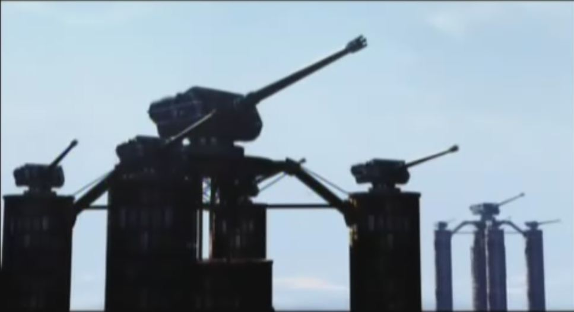
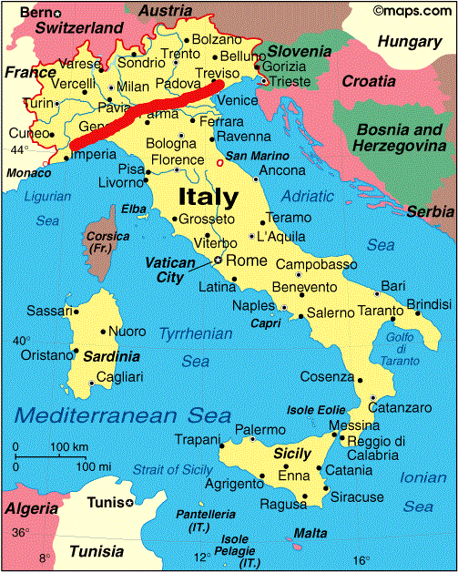
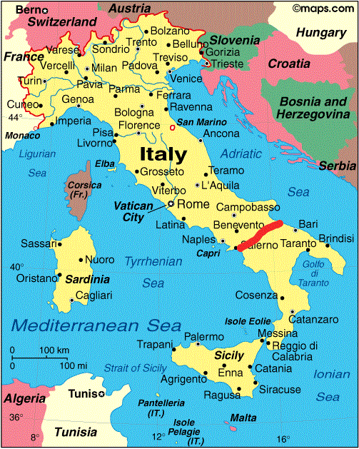

# Turn 4, April 1946: War

###Venezia and Romagna
- **Pros:** Would help you link up with the Suez Hive
- **Cons:** The nations on the Italian Peninsula didn't contribute large amounts of forces to any of the nearby campaigns, meaning their military forces are still intact. Would have to rely on air units to gain a foothold.

You consider your choices. Going to Gallia or Ostmark with your forces is out. Gallia is too well fortified, and Ostmark could call for Orussia. That leaves Baltland on one hand, Romagna and Venezia on the other.  
Going to Baltland is tempting. After all, you did just devastate their entire military a couple months ago. However, The Italian Peninsula calls you more. You owe Suez a favour, and it's time to pay it back.

First though, you need a foot hold on the other side of the Alps. The small, independent confederacy of Helvetica will do nicely. Your forces advance swiftly through the mountainous country, smashing aside most resistance. However, you still sustained casualties, particularly among the Infantry Bots and Small Type Flyers.  
**Lost** `9` Infantry Bot Divisions, `2` Anti-Vehicle Bot Divisions, `1` Walker Group, `6` Small Type Flyer Groups, and `2` Medium Type Flyer Groups

Still, Helvetica is yours now, and you have a direct line of attack on Romagna.  
Unfortunately, if you want to take Romagna, your first obstacle is the Alpine Wall. Countless fortified sights, built into the mountainsides, and in many other cases, they are filled with AA guns, with air bases nearby ready to launch hundreds of fighters and bombers to oppose any invasion. As the war continued, the Wall was only reinforced further.

A ground assault will be a nightmare. Your heaviest units unable to move along the mountain passes, and your lighter ones vulnerable to the volume of fire you will be exposed to. If you want to punch through, you'll need to use your aerial units to clear a landing zone for your bigger transports on the other side of the Alps.

There are multiple areas of importance where you will face the most resistance, and would be best to neutralize these points while clearing a landing zone.

**Genoa:** Home of the Romagnan fleet. They have multiple battleships and other ships ready to deliver long range firepower anywhere along the coast if they are allowed to leave port.

**Italia Airfield:** The bulk of Romagna and Venezia's fighter squadrons in the north are based here. Protected by a fortress of AA guns and covered with hangers for hundreds of fighters, and even a few Witches.

**Alpine Defense Perimeter:**  
  
If there's anything that'll stop you, it'll be this.  
A massive net of AA guns of all calibres, built in a dozen key locations across the mountains. Unless you destroy these, your transports will be blown to pieces.

Aside from this, there are several lesser military bases near the Alps. Once clear of the Alps, you can land your transports anywhere. But first, you must secure a clear landing zone for them.

*What are your orders?*

---

##Invasion of Romagna, Part 1

###Plan Javelin
- **Stage One:** Deploy N Witches and Small type flyers as Strike Teams and approach at high speed and low altitude under the cover of darkness, ideally getting below their radar screen and moving in small enough numbers that it shouldn't cause an immediate panic -- at the moment, they shouldn't have proper doctrine to counter Witch-types on our end. Focus on targeting regions to get us access corridors to Genoa and the Italia Airfield. Use Strike Teams to cripple AA defenses in these areas, and allow a swift follow up attack from the rest of our Air Force. Make use of radio jamming and communications blackouts during this window to delay enemy response and coordination.

- **Stage Two:** With openings made by Stage One, launch an attack on Genoa and the Italia Airfield, doing as much damage to their warmaking potential as possible. This obviously goes easier if Stage One is well coordinated, and if Stage Two happens fast enough, we should be able to do critical damage before they can prepare their defenses in depth. They'll be on alert, true, but as we've yet to employ comm jamming in the past, they'll expect to get at least some early warning, so they won't have their full forces mobilized. This gives us a chance to repeat our success in our previous ambush. Even if we fail to destroy their warmaking potential outright, we can soften them up.

- **Stage Three:** While the enemy's warmaking potential is being attacked during Stage Two, have our Units secure a landing position and have our transports land our troops. At this point, the ground battle is more-or-less a matter of time.

- **Stage Four:** Build Torpedo Launchers to secure the coats: `200` RU

---
**Alpine Defense Station 7**  
"Sir, were we expecting a patrol to return soon?"  
"No, we weren't, why?" The Venezian commander asked.  
"Well, we've got several witches inbound, from what we can tell."  
A pause. "Let me see."  
The man paled. "Sound the alarm! We've got Neuroi inbound!"  
"But sir, those are Wit-"  
"Didn't you hear the reports from Karlsland!? Now man those Machine Guns!"  

Across the Alps machine guns are frantically manned and trained on the Neuroi. Volleys of fire leap out, smashing through several, but it's too little, too late.  
Lasers erupt from emitters, skewering the unprepared AA gunners. Several of the large guns are destroyed in quick succession.  
Frantic distress calls go unanswered as Neuroi jamming leaves the rest of Romagna and Venezia unaware that the Neuroi are travelling through the Alps. A massive fleet of Large and Medium Types quickly move in. What few guns remain train on their targets and open fire, inflicting some damage, but not enough.  
**Losses:** `4` Small Type Flyer Groups, `1` Large Type Flyer Group

---
"Admiral, is something wrong?"  
Romagnan Admiral Carlo Bergamini nodded grimly. "Tell the fleet to ready themselves for combat and to move out of the harbour."  
"Sir?"  
Bergamini shook his head. "We've just lost all contact with several Alpine Defense Stations. No distress, no weapons fire, just static."  
"Sir, that could mean anything. Maybe they're just having equipment problems."  
"Maybe, but I doubt it. Call it a hunch, and make sure all guns are loaded and pointed at the sky."  

When the Neuroi appear over Genoa, they find themselves staring face-first into the barrels of the alert, mobile, and fully operational Romagnan Navy.  
"What did I tell you? OPEN FIRE!"  
It's like a shooting gallery. Your Large Types are especially hit hard, with their massive bulks pounded again and again by Anti-Neuroi and Armour Piercing rounds. Hundreds of Neuroi are wiped out by AA fire, and even though you do severe damage to Genoa's Infrastructure, the Romagnan Fleet has escaped more or less intact.  
**Neuroi Losses:** `7` Small Type Flyer Groups, `7` Medium Type Flyer Groups, `9` Large Type Flyer Groups, `1` Neuroi Witch Group  
**Human Losses:** `City of Genoa` Destroyed, `Heavy` Civilian Casualties `3` Cruisers, `5` Destroyers

---
While the news from Genoa are bad, the attack on the Italia Airfield goes almost perfectly. Unlike Genoa, they saw nothing suspicious about the Blackout, and were caught almost totally unprepared. While alert AA gunners and fighter patrols have inflicted some casualties, for the most part the entirety of Venezia's Air Force on the Italian Peninsula has been destroyed.  
**Neuroi Losses:** `7` Small Type Flyer Groups, `2` Medium Type Flyer Groups  
**Human Losses:** Over `800` Fighters, `6` Witches, `Italia Airfield` Destroyed

---
Your ground forces' landing is a bit more painful than you would have liked. Several cleverly hidden gun emplacements managed to survive the sweep from you air units, and destroy several Transports before being rooted out and destroyed. Finally though, you have a foothold on the other side of the Alps.  
**Losses:** `12` Infantry Bot Divisions, `5` Anti-Vehicle Bot Divisions, `12` Neuroi Walker Groups, `3` Ultra-Heavy Walker Groups

---
From there your forces make rapid headway across the Peninsula, sweeping aside the scattered resistance. Torpedo launchers scatter the coastlines nearby your forces, meaning your currently conquered territory is safe from naval bombardment, for now. Unfortunately, you still have a long ways to go before you've fully conquered Romagna, and your forces have already been heavily depleted.  

The Red Line indicates the extent of your advance.

Venice is the capital of Venezia, and while you are advancing on it, from what you can see it is well defended, and ready to hold the line against your forces. Taking Venice could demoralize your opponents, but you would have to divert extra forces to ensure its fall, slowing down your advance significantly.  
At the same time, a rapid Blitzkrieg across Romagna could devastate the humans before they could rally a proper response to your attack, if you move quickly enough, but it would mean leaving strongpoints like Venezia behind your lines.

---
###Orders?
- Divert forces to Venezia
- Ignore points like Venezia, have your forces rolls across the Peninsula as far as they can manage
- Write in?: There are always other things you can do.

---
- Bypass Venice. Set up fortifications to prevent a breakout, and take advantage of the panic your assault has caused to sweep the rest of Venezia and Romagnia of enemies.
-  Avoid civilian Casualties. Humanity has shown that in its insanity, incredible feats can be performed. By not creating situations where humanity's insanity will ignite, we deny them there insane powers. Neuroi units will avoid civilian casualties where possible, and focus efforts exclusively on human military forces.
- Sweep down to the very coast lines at the end of Italy. Attempt to then link up with Suez via air units. 

---

It is April 30th, 1946.  
For the past week, the Neuroi have forced their way across Romagna. Florence fell in hours, it's defenders unprepared for the horrific onslaught. Millions of refugees clog the roads further south.  
Grosseto stood a better chance. It held out for a day.  

As the Neuroi pushed south, the Romagnans fought with greater and greater ferocity. For all the good it did them. Rome found itself occupied by a ragtag force. Scattered military formations and armed civilians alike went shoulder to shoulder in the face of death itself, promising to take at least one Neuroi with them. For a week straight they battled against the Neuroi. Every street was paid for in blood, every man, woman, and child was a soldier, and by the end of that week, not one of them was alive.  
Rome has fallen. The Vatican is in ruins. Its monuments to the old Roman Empire, gone, its people dead, my people dead.

Desperate, knowing that the Neuroi were counterattacking on every front, the surviving people of Romagna desperately called for aid.

To everyone's astonishment, they got it.

Hispania, locked in Civil War, united to send what it could. The Tsar, who had ignored Europe, rallied his western armies to be sent into battle. Dacia, Moesia, Ostmark, the Ottoman Empire, all sent what they could. A massive fleet escorted ships across the Mediterranean.  
Venice, capital of Venezia, had somehow held out against the horde. Now, it became home to a massive staging ground. Dozens of Witches, some experienced, many more volunteers or conscripts rallied there, supported by reinforcements from across the Mediterranean made the city their home. A city that now resembles a fortress.

Further south, across ports still under human control, over a million soldiers have already disembarked, and even more come every day. Every able-bodied citizen of Romagna, regardless of gender, has armed his or herself for battle. More weapons continue to come from Karlsland, escorted by massive fleets, shrugging off losses from new Neuroi Submarines to bring us what we need.  
New tanks, jets and jet Strikers, the legendary 501st JFW, advanced weapons that no human has ever seen before.

Yes, the Neuroi have overwhelmed most of our beloved country, but it has cost them. Brave millions before us have given their lives to devastate the invaders, and now they totter at the edge of annihilation.  
Now we will pay them back for every life they have taken. Our fleet is intact and armed, our armies are ready for battle.  
We are the people of Romagna, and we will not relent until our gun barrels melt and the last breath leaves our bodies.  
We are the people, the soldiers of Romagna, and we are at war.

  
Red Line indicates the *new* extent of your advance. You were originally supposed to be stopped at Rome at furthest.

**Losses:** `64` Infantry Bot Divisions, `32` Anti-Vehicle Bot Divisions, `10` Neuroi Walker Groups, `18` Small Type Flyer Groups, `8` Medium Type Flyer Groups, `14` Large Type Flyer Groups, `7` Ultra-Heavy Walker Groups, `2` Neuroi Witch Squadrons  
**Gained:** `9690` RU, + 1,500` RU per turn
