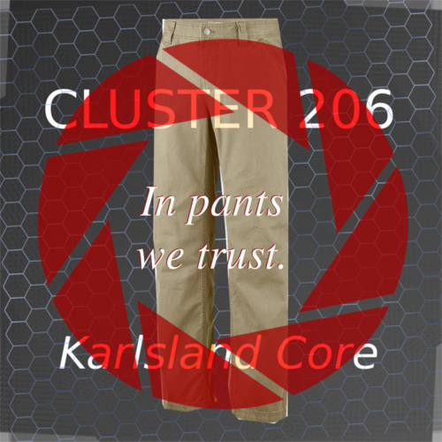
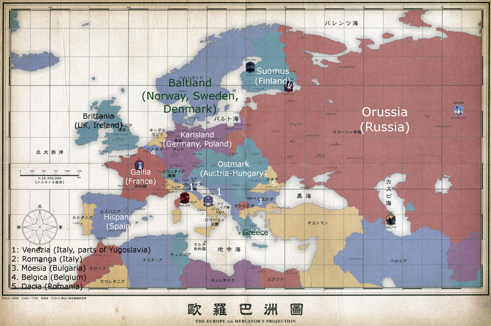
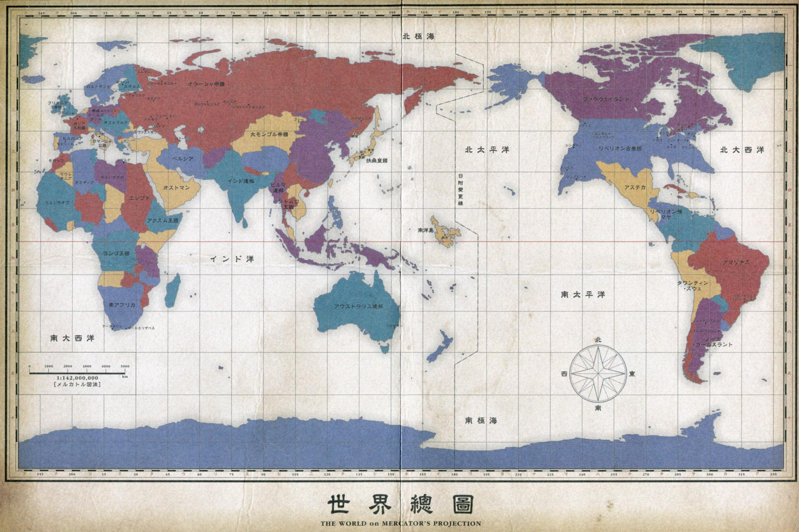

#Neuroi Quest Thread 3: Panted And Dangerous!
[Source Thread](https://forums.spacebattles.com/threads/neuroi-quest-thread-3-panted-and-dangerous.299890/)

  
  

##Status

####Resources (RU): `5` RUs
####Income: `6,750` per turn
####Units:
- `100` Infantry Bot Divisions (Very Strong vs infantry, weak vs anything else, good at garrison and urban warfare) (Costs 8 RU) (10,000-20,000 Bots per DIvision)
- `40` Anti-Vehicle Bot Divisions: Very Strong vs Light Vehicles, Strong vs Tanks, weak vs Infantry and aircraft, Short ranged) (Costs 8 RU) (10,000-20,000 Bots per DIvision)
- `35` Neuroi Walker Groups (Strong vs Tanks, Infantry, Slightly Strong vs Air units, Weak vs witches and Artillery) (Costs 20 RU) (50-100 Walkers per group)
- `45` Small Type Flyer groups (Strong vs bomber and fighters, Decent vs lightly armoured ground units, weak vs Witches, Very Weak vs AA) (Costs 16 RU) (20-40 Flyers per group)
- `35` Medium Type Flyer Groups (Strong vs most ground units, Slightly Strong vs fighters, Weak vs Witches) (Costs 24 RU) (12-20 Flyers per group)
- `15` Large Type Flyer Groups (Strong vs most units, Slightly Strong vs Witches, few in number) (Costs 40 RU) (8-12 Flyers per group)
- `10` Ultra-Heavy Walker Groups (Very Strong vs all ground units, Slightly Weak vs bombers, very few in number, big and obvious targets) (Costs 80 RU) (5 Walkers per group)
- `5` Neuroi Witch Mark II Groups (Strong vs Witches, bombers, light vehicles and infantry. Strong vs Fighters, ships. Decent vs AA.) (Cost: 240 RU per group) (5-8 Witches per Group)
- `4` Submersible Battleships (Costs 400 RU) (Excellent v.s. Ships, Fortifications, Very Good against most other units, Decent v.s. Submarines, bombers, Witches)
- `15` Escort Submarines (Costs 80 RU) (Excellent vs Transports, Good vs aircraft, Decent vs ships, Weak vs Witches and Submarines)
- `0` Land Battleships (Costs 960 RU) (Excellent v.s. Everything)
- `8` Multi-Laser Artillery Groups (Costs 60 Ru per group) (Excellent v.s. Fortifications, Very Strong v.s. Most units at long range, Weak v.s. anything that can get close) (8 Per Group)

####Map of area

####Holdings:
`Direct Control` of Karlsland and Helvetica(RL Switzerland), Romagna, Sicily, Venezia, Ostmark, Moesia, Dacia, Serbia, Greece, All of the Balkans.

`Suez Hive:` Egypt, Libya, Sinai Peninsula  
`Atlantic Hive:` Corsica, Sardinia  
`Vladivastok Hive:` Parts of Siberia  

####Fortifications:
##### (classified: Non-existent ,Light, Medium Heavy ,Impregnable; Costs 1,000 RU to raise a level in a region)
- Karlsland: Medium
- Helvetica: Medium
- Italian Peninsula and Sicily: Medium
- Ostmark: Medium
- Balkans: Light

####Space Forces
- `0` Multi-laser Orbital Satellite Batteries (Costs 225 RU per Battery) (6 per Battery) (Excellent vs Strike Craft, Weak vs larger ships)
- `0` Plasma Beam Satellite Batteries (Costs 300 RU) (6 Per Battery) (Strong v.s. Escorts, Decent v.s. Lines in numbers and Strike Craft, Weak v.s. Capital Ships)
- `0` Nuclear Missile Satellite Batteries (Costs 450 RU) (3 Per Battery) (Strong v.s. Lines and Escorts, Decent v.s. Capital ships in numbers, Weak v.s. Strike Craft)
