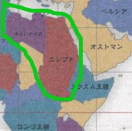
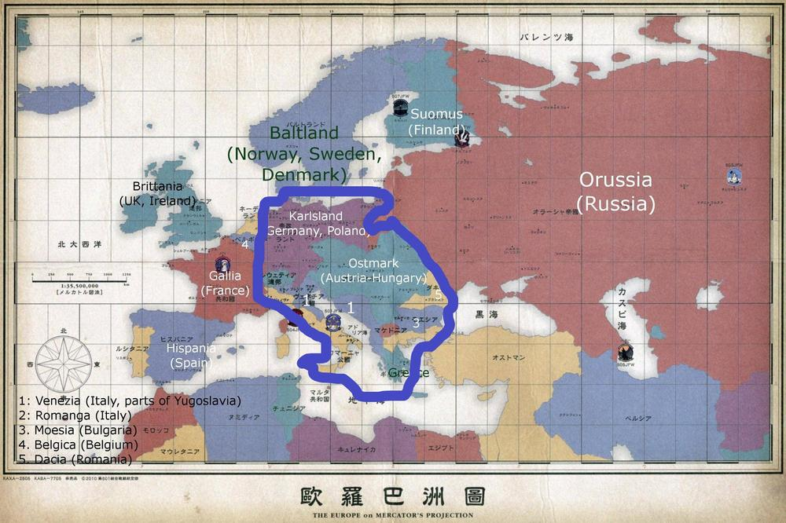

#Turn 7, July 1946: Territories unded rule of Neuroi

Right then, here's VV's territory.  
  
In the black is fully under her control.  
Red territory is contested, and tends to seesaw back and forth between Neuroi and humans.

  
Suez's territory is in the Green.

  
And Berlin controls everything inside the Blue.  
Atlantic holds the Orange and Yellow islands near Romagna.
