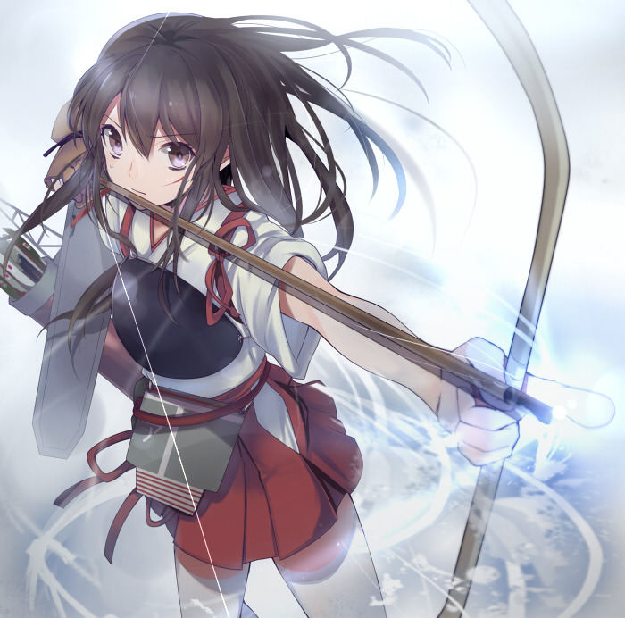
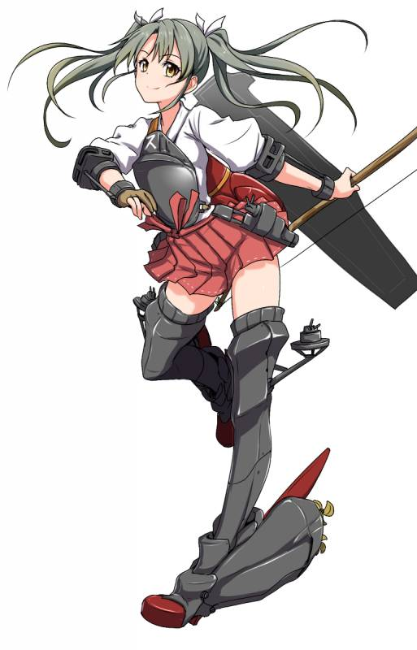

#Scars That Never Heal

###By SirLagginton
###Status: Canon

Song Su-Hyun trembled and coughed red as she was brought out of the facility that had been her personal Hell for half a year, looking confusedly around the forest she had never expected to see again, the thing (*Neuroi* she reminded herself) that was currently carrying her in its arms and the buildings burning behind her. Everything was happening so quickly, she could barely comprehend it, she was being carried away by something she was always told was a monster, and yet it was taking her away from *that* place?

It hit her then, clear as the sweetest water from the river by her home, she was free, the Neuroi were *rescuing* her. Her voice choked, eyes tearing at thought of never being subjected to *their* experiments ever again. For the first time in months, Su-Hyun cried.

---

When the strange black Neuroi vehicle finally stopped at the edge of a field of more Neuroi machines, her rescuer came again, gently picking her up in its alien manipulators. Even if she was approaching a mind to cause trouble for her savior, months of starvation and experimentation had sapped whatever strength she had once possessed, as it was, she put up no resistance as carried her out to a large black machine in the center.

She froze when she saw the inside of the machine it was taking her to, a dark cavern with only a pulsating red lights inside. She gave out a half-choked sob at the sight and tried to squirm away to anywhere, anywhere that wasn't *there*. Memories of her claustrophobic, dark cell back at the facility sprung to her mind, choking her mind like a black miasma, anywhere, *anything* but back there.

The Neuroi carrying her stopped and directed its optics towards her, obviously sensing her distress, and before Su-Hyun could decide between causing her savior any trouble and begging it to take her *anywhere else* that wasn't that machine, a shriek of terror filled the air. Startled, Su-Hyun turned to look beside her and saw a little girl, no more than the age of seven, scream and sob at the sight of the dark machine. The entire column heading towards it seemed to freeze at the sound of the girl's cries, before deciding to retreat back away from it. That seemed to calm the girl down, and the Neuroi stood still for a moment, seemingly unsure of what to do.

The answer came in the form of a of crowd of black scuttling Neuroi, swarming over the dark machine, bright flashing lights and sparks forcing Su-Hyun to look away. When the Neuroi finally backed away, she could see little windows cut and placed into the sides of the craft, and bright lights sparking to life inside.

She had cried for the second time that day, thanking them for their consideration and kindness, the only response being them carrying her inside the craft and carefully strapping her in. The floor lurched suddenly, shouts of surprise coming from the former prisoners before they looked outside and gasped. The machine was flying! It was a sight that the majority had never seen before and most stayed stuck to the windows, awed by the sight.

Su-Hyun herself shrunk away from the window, memories from her flight from her home country of Inchon to the facility haunting her. She wished her family was here with her, especially her brother Tae-Hyuk. He had always wanted to fly.

---

It was the lurch that woke Su-Hyun from her bitter dreams, a sign she knew from past experience that they were back on terra firma. She suddenly looked around desperately, before realising that she was still on the Neuroi craft, she was still free, still safe from *them*.

Her savior was back, gently picking her up in its arms and carrying her out of the aircraft with its crablike legs. Even now she could see people being carried out of the craft being segregated into two groups, one group comprising of her and several dozen other young girls, and a much larger group consisting of everyone else. A flash of terror struck her, were they being segregated like in the facility? For the purposes of more experimentation?

She then immediately crushed her unworthy thoughts with a vengeance. The Neuroi had saved her from Hell itself, how could she possibly think that they were monsters just like *them*? She felt revolted with herself for even thinking to compare the two, nothing, *nothing* could possibly compare to the monstrosity of *them*, certainly not her saviors.

Gritting her teeth in anger at her display of unworthiness, she suddenly choked on blood, lungs suddenly hacking and burning in pain as she spat blood. The last, *mocking* curse of the facility still lingering within her veins. She desperately shook her head when she saw her savior's crimson optics reorient on her, not wishing to cause it unnecessary trouble. If anything though, that seemed only to concern it further, its pace accelerating to a group of more Neuroi machines, machines, she realised, she recognised from when the Neuroi had first rescued her. They lowered her in, a near-perfect rendition of the time they had rescued her, and then drove the vehicle off.

The first few minutes went past in silence, neither a word from her silent rescuers nor the her fellow prisoners, then something poked into her side.

"Hey." Su-Hyun blinked and looked to the source of the poking, where she found a girl near her age poking a finger into her side, speaking in Zhongwen. "Hey, hey. I can't be the only person here with a functioning mouth, speak already, the silence is going to drive me nuts at this rate."

Su-Hyun tried to dredge up her old lessons in Zhongwen, Inchon's relationship with its neighbor was millennia old, the result of trading routes and the cultural exchanges that had taken place therein. Some families had insisted on teaching their children the language, and it was with some hollow gratitude that she remembered that her family was one of them.

"I-" Su-Hyun paused, trying to get a feel for the language again. "Yes, I can speak." She coughed a little, the magic in her system burning to keep the disease back.

Her new acquaintance frowned. "Huh, accent's weird, guess you're not from anywhere I was. You from Yuunan or Sichuan? Whatever, name's Meiling, Huang Meiling, what's yours?"

"Su-Hyun." Su-Hyun shook her head, somewhat envious that the other girl had some much energy left in her despite their ordeal. "Inchon."

"Inchon? Wooooah, that's real far away!" The other girl gave a gap-toothed grin. "That's so cool! Say something in Inchon!"

"시끄럽다."

Meiling scrunched up her face, obviously trying to divine the meaning of the words and failing spectacularly. "...So, uh, whuzzat mean?"

"You're loud." Su-Hyun responded dryly.

"Heeeeeey! I'm not that bad!" Meiling mock-pouted, before breaking into a set of giggles. Unable to help herself, Su-Hyun quickly joined her.

"Soooo." Meiling said after their last giggles died down, she hesitated before continuing. "How long were you...Well, *there?*"

Su-Hyun's face darkened. "Six months."

"*Six months?*" Meiling gasped in horror. "Gods above, I barely survived three days in that Hell! I'm sorry, so, *so* sorry."

Su-Hyun held a hand up, shaking her head. "Meiling, I'm good, I'm fine, the Neuroi saved us right? We're not going to back there ever again."

"I-I guess." Meiling still looked conflicted. "But still-"

"*Enough.*" Su-Hyun looked for something else to change the subject. "So, how did you did lose that tooth?"

"I-Whuh?" Meiling looked surprised for a moment, blinking for a moment before pointing to the gap. "Oh, this? Well when I got brought here, there was this Fusoan witch supposed to be handling me, might've been the same for you. Called her Bitchtits. Anyway, got sick of that real quick, so on the second day I kiiiiinda ambushed her and gave her a nice shiner right in the eye." She pointed to her eye, grinning. "She knocked this tooth out in response, among... other things. I'll still cherish the memory though."

Su-Hyun laughed. "Really? You did that? I wish I managed to do something similar in my time there."

Meiling laughed uneasily. "Trust me, you kind of don't. What they did after... wasn't fun."

"Hey." Both girls turned to find a dark-skinned girl glaring at them. "Some try sleep." She said in broken Zhongwen. "Quiet."

"Sorry." Su-Hyun whispered before turning back to Meiling. "Guess that's my cue, wake me when we're there."

"Uh huh." The other girl mumbled, staring at the sky.

Looking curiously at Meiling before shrugging, Su-Hyun went to sleep.

---

"Yoooo, Su-Hyun? I think we're almost here." Something familiar poked into Su-Hyun's side.

"Blarrrgh?" Su-Hyun jerked and groaned blearily as she got up, shaking off her lingering nightmares. Even after finally escaping from the Fusoans, they still persisted, taunting her with everything she had lost to them.

"I-I'm up." She broke out into a hacking cough, splotches of red splattering on her hand. "What's up?"

"Are you okay?" Before Su-Hyun could react, Meiling grabbed her hand and examined it. "Gods above, you looked like you've puked out half your lungs. You need to get this looked at."

Su-Hyun pulled back her hand. "I'm fine."

"Are you shitting me?" Meiling said incredulously. "Look at that! Witch or not, that looks fucking serious. I'm sure the Neuroi have some fancy-pansy medicine or something that can help-"'

"I'm *fine.*" Su-Hyun insisted. "There is no need to bother anyone with this."

Meiling glared at her for a moment, but she reluctantly backed down after seeing that Su-Hyun wasn't going to budge. "Fine, but don't think the Neuroi saved you only for the sake of you puking your guts out later."

"Noted." Su-Hyun grunted, looking around and seeing the majority of her fellow witches already up and talking with one another. "Okay, so what did you wake me up for?"

Meiling sighed, obviously still worried about her friend, before pointing into the distance. "That."

Su-Hyun blinked in confusion, not seeing much of note. "I don't get it."

"Use magic."

"I-" Su-Hyun frowned as a set of Leopard Cat ears appeared on her head. "Is that a fortress of some sort?"

Meiling nodded. "Think so, yeah. The walls are certainly big enough, a bunch of the other girls think it looks western. Can't help but wonder where the heck we are, definitely not in Kansas anymore."

Su-Hyun looked at Meiling strangely, causing the other girl to break out in a set of giggles. "Sorry, it's from this western book I got from this trader. Mom was sooooo mad when she found out I wasted money on a book." The other girl's grin suddenly faltered. "I hope she's ok."

"Hey, I'm sure she's fine." Su-Hyun said, trying to shake off memories of how her own mother had died. "I mean, she wasn't with you when the Fusoans found you right?"

"Yeah." Meiling gave a muted nod. "She was busy with some laundry, so she sent me to get some vegetables." She sighed. "Terrible fucking time to be at the market that day."

"Fusoan troops?" Su-Hyun asked, wincing.

"Fusoan troops." Meiling shuddered. "She must be worried sick by now."

Su-Hyun didn't have anything to say to that, and the next few minutes passed in silence before a quintet of shapes of shadowed the vehicle they were riding. Gasps sounded from the former prisoners as they recognised the shapes as witches, if they were built out of that strange metal the Neuroi used and lined with a glowing red. The lead Neuroi, different from the others from the lack of weaponry and a different helmet that characterized her fellows, descended upon them, easily keeping pace with the vehicle despite having to fly backwards.

Many of the girls blinked in surprise at the appearance of a simple smiling face appeared on her helm. "Hello, I am Emissary Zero Zero. Most future interaction between our races will be left to those of our design. Allow me the pleasure of being the first to greet you to your new home, I hope it shall be of adequate satisfaction. If you have any questions, I shall endeavour to answer them now."

"*Warm*" Su-Hyun thought. "*She seems really nice.*" Beside her, Meiling hesitantly raised a hand. "I'm really grateful for how you all rescued us and all, really, but will we be able to see our families again anytime soon? I'm the only one Mom really has left."

The Emissary's voice seemed to take on a downcast tone. "Unfortunately, due to our current conflict with the human governments we are unable to spare the time and resources to safely return you to your homes. Furthermore, the Empire of Fuso still retains control of Zhong Guo and Inchon, and is currently conducting further advances down South-East Asia, therefore we believe that there is a likely possibility that there will be efforts to recapture you should you be returned. I am sorry we are not able to render more assistance in this matter."

Meiling seemed to slump despondently. "...No, no, it's alright. You've done more than enough for us, I guess we wouldn't even be here if it wasn't for you."

"We shall endeavor to correct this situation the moment the situation allows us to." The Emissary inclined her head. "Are there any further questions?"

A hand rose up from one of the other girls. "Where are we?"

"We are currently in southern Karlsland, more specifically near the town of Fussen, also situated near the Bavarian Alps, a well-known mountain range in the area. Is there anyone else?"

Chatter rose up from amongst the girls at the revelation of their location. Another hand rose. "Um, that castle over there is supposed to be where we're living right? Can you, uh, tell us more about it? It looks really pretty."

The helm lit up in a smiling face. "Certainly! According to sources we have found pertaining to this castle, which is called the Neuschwanstein Castle, it is 78 planetary cycles old, and commissioned by order of Ludwig II of Bavaria, back when Karlsland was still divided into separate states. Well-regarded for his architectural achievements, Neuschwanstein is considered his crowning achievement and a symbol of Romantic architecture. Currently it is the home of several young witches like yourselves, whom we hope you shall become friends with."

Murmurs went through the girls as Su-Hyun and Meiling exchanged a look, were there more victims of the people who ran the facility or people like them? The idea that the facility from where they were rescued was not the only was... *horrifiying*, how many more people were suffering as they did?'

Before one of them could dredge up the courage to ask the question however, the Emissary suddenly turned around and pointed a hand to the [magnificent white castle](../images/witches_castle.jpg) that had suddenly appeared before them. "While I do not mind answering further questions, we believe it best that you are introduced to your new co-inhabitants first before any further questions are asked. We hope you shall all get along!"

Su-Hyun gawped at the massive structure before them, vaguely aware that Meiling was doing the same beside her. Intellectually, she knew it was big when she had first looked upon it, but the reality close up was even more imposing, even the governor's palace back home could not possibly hope to compare to this!

The vehicle column entered through the gates, and in the courtyard Su-Hyun could see several of the supposed witches already living there out in the courtyard staring at the procession, some of them whispering with one another. One of them, a girl with strange carrot-colored hair, caught her staring at them. Grinning, she started waving boisterously to them.

"Um." Su-Hyun started waving meekly back, before letting out a surprised squeal as Meiling grabbed her hand. "Hey, hey! That's no way to wave to somebody! You do it like thiiiiis!" She grinned cheekily as she started to wave both her and Su-Hyun's arms like a madwoman. The strange foreign girl laughed when she saw this, before turning back to her group and resuming her talk.

Su-Hyun gave a small start of surprise when she felt arms enclosing around her, before relaxing immediately when she realised that it was her Neuroi savior. She could see Meiling hop off on her own accord, being one of the few strong enough to walk under her own power.

With a grin Meiling grabbed Su-Hyun's hand and started dragging her to where they saw the foreign girl. "Meiling, I'm not sure this is a good idea..."

"Whaaaat? Of course it is!" Meiling replied cheerily. "Plus, I wanna find out where that girl is from, and how she grew those-" She suddenly started making motions with her chest, grinning madly at Su-Hyun in the meanwhile.

"Meiling!" Su-Hyun squealed in embarrassment, making the other girl laugh as she dragged her friend across the courtyard.

Meiling waved a hand as she got close to the group, starting to chatter animatedly with the foreigners in a language Su-Hyun didn't understand, leaving her to look bemusedly as Meiling chattered and made gestures towards her she didn't understand. One or two times though, she could see the present witches take disturbed glances at her, making her squirm into the robot in embarrassment.

"Hey!" Meiling started speaking towards her in Zhongwen again. "Carrot girl's name is Charlotte, and she's from Liberion! The one with pigtails is Gertrude from Karlsland, and the golden-haired girl is Sarah from Australia! Apparently they've only just arrived here as well."

"How do you even know what they're speaking?" Su-Hyun asked curiously.

"My town was a trading port, and I liked to wander over to the docks every once so often." Meiling smiled. "Lotta foreign traders there, some with great stories. I sorta picked up the language over time."

Meiling turned back to the foreigner girls, and before Su-Hyun could resign herself to being part of a conversation she didn't even understand, an exclamation from one of the girls drew her attention to the entrance of the castle. Wait, what had that girl said? She said-

Two girls passed through the door, talking excitedly with one another. They also sported a look that Su-Hyun had desperately hoped never to see again.

"*Yoshika.*"

"No." Su-Hyun whispered, already starting to hyperventilate. "No, *no, no, no, NO, **NO!***" She screamed, startling the foreigner girls. Meiling, who had frozen up the moment she saw the two newcomers, suddenly slapped aside a hand raised in concern for her and started backing away, white-faced and trembling like a leaf.

Alarmed, the two girls (*Fusoans*) starting running towards her.

"Stay away!" Su-Hyun screeched, clawing out of the grip of her Neuroi minder and dropping to the ground in a desperate attempt to get away. "Get away you fucking monsters!" She turned to her Neuroi savior. It *saved* her right? It'll protect her from *them*. "Please." She sobbed. "Not them, anything but *them*. I'll do anything, but not *them*."

Like a predator to the scent of blood, if anything her screams drove the Fusoans more quickly to her, until like the Messengers of Heaven themselves, Neuroi witches dove out of the sky and restrained them, allowing her Neuroi savior to quickly scoop her and scuttle back from *them*. Another Neuroi landed next to Meiling, dragging the trembling girl to safety.

By now the entire courtyard had seen what was going on, and desperate screams and sobs resounded as the former prisoners attempted to get away with near-feral desperation. Seeing that the situation was spiraling rapidly out of control, Neuroi minders quickly gathered their charges and retreated away as Neuroi witches quickly piled the others back into the castle.

---

"What the *bloody fuck* was that?"

"We may have... *underestimated* the level of psychological trauma involved." The Emissary admitted.

"Fucking *really?*" Matsuda Shouko snarled. "You torture a group of fucking girls and you '*underestimate*' how bad they come out of it? You goddamn alien bint, what the fuck did those girls ever do to you to deserve *that*? Kill your fucking puppy?"

"...Shouko, I don't think the situation is exactly like that." Charlotte Yeager ventured cautiously.

"You do not appear to understand the full context of the situation." The Emissary agreed.

"*Don't bullshit me!*" Shouko roared. "Charlotte, you saw those girls! Skin and bones, with scars everywhere! I'm not fucking blind, those girls have been tortured, and who the fuck would do that apart from you fucking Neuroi!" She pointed an accusing finger at the Emissary. "Did you like dangling healwitches in front of them and taking them away? Is this some sort of sick goddamn game to you? So what other pathetic excuses have you cooked up then? Go on! I need a fucking laugh after seeing that!"

"*Shouko.*" Gertrude barked, grabbing her arms and restraining her before she lost all self-control and outright attacked the Emissary. "We're all unhappy with the situation right now, but ranting like this is *not helping.*" Gertrude then glared at the Emissary. "Alright, so if you're claiming that you're not responsible for the condition of those girls, then who is?"

The Emissary paused for a moment, before a familiar scratchy sound all those present recognised as a radio broadcast sounded through the room.

"*...And in a series of shocking statements, the Communist Party of Zhong Guo has accused the Empire of Fuso of atrocities of an *unprecedented* scale-*"

"*...After careful examination of the evidence presented by the Communist Party of Zhong Guo and extensive consultation with our sources in Asia, we have found the Empire of Fuso guilty of the grossest and most inhumane violations of both the Geneva Conventions and the Geneva Protocol. The United States of Liberion condemns these horrific acts, and will sever all diplomatic and economic relations until such a time comes that the Fusoans feel they can conduct themselves as human beings once more.*"

"*...As the result of last week's stunning announcements of the severing of trade ties with Fuso by the nations of Britannia, Liberion, Gallia, and countless others, stock market prices have dropped by an astounding 12%, and show no signs of stopping anytime soon. Economists fear that the stock market crash of 1929 is likely to return if investor confidence is not restored soon.*"

"...What." Shouko said, as the other girls shared shocked looks. "No, bullshit. The Empire of Fuso wouldn't sully its honor with torture like that, it's a fucking lie!"

"...The-the rumors." Yoshika whispered to herself, shaking.

"The rumors are bullshit Yoshika, anyone with two brain cells to rub together would know that." Shouko shook her head. "The Army is full of morons, but they wouldn't lower themselves to *that*. It's an alien machine, it could've easily faked those recordings."

"They seemed pretty nice until you and Yoshika appeared." Sarah said, her voice conflicted.

"Kami above! Not you too Sarah!" Shouko gritted out.

"Subject appears to require further proof." A statement, not a question.

Shouko glared at the Emissary, her mouth set into a grim, angry line. "You bet I fucking do."

The Emissary nodded, and a strange light appeared from her eyes, directed at the far wall. After looking in confusion for a moment, the girls turned around, realising it was some sort of colored movie projection.

*A walled compound roared with gunfire as soldiers from all nations descended upon it, all racing for the prize that laid within. The view suddenly dropped, revealing itself to be a Neuroi as bright crimson beams spat from its arms and smote the guard towers desperately attempting to return fire. Ignoring the shouting and pointing from the other attacking forces, it poured more fire into the compound, suppressing the enemies within as great obsidian monoliths appeared in the sky, disgorging a swarm of Neuroi infantry and assault walkers.*

Shouko clenched her hands as she saw men in Fuso army uniforms being struck down, but she kept quiet.

*The view changed, a wall being smashed aside by a Neuroi walker. A Fuso army squad attempted to slow it down, only to be incinerated for their trouble in a volley of liquid sunfire. It passed by the blackened trenches its weaponry had dug and smashed through another wall.*

"No..." Shouko whispered. "No, *why?*"

"*Mein Gott.*" Gertrude murmured, her face pale.

Yoshika cried into Charlotte's chest, a sorrowful look on the older girl's face as she hugged the Fuso girl. Sarah just dropped back down on her bottom, staring at the scene.

*A woman lay on a medical table, limbs bound by black leather straps. Blood pooled around her, red fluid pumping out of her partially dissected lower body. Intestines were splayed around her with morbid care, bits of other organs located around her. By some twisted miracle she was still alive, body jerking spastically as eyes looked desperately at the Neuroi, begging, pleading.*

*Almost gently, it raised a plasma cannon to her head.*

*Another Neuroi scurried down the corridors, periodically stopping and rotating its sensor mount, obviously looking for something.*

*"Hurry up Ryota! We gotta execute those fucking prisoners before the Neuroi find them!"*

*The Neuroi paused, before suddenly barreling down the corridor to the right, blazing lasers instantly cutting down a trio of Fuso soldiers. Looking towards the direction the men were heading, it started to quickly scuttle, more Neuroi pouring out of adjacent doors and corridors to join it in a black wave of alien machinery.*

*Reaching the door to the cellblock, they smashed through in time to find a Fuso witch leveling a pistol at a prisoner. As one, the Neuroi fired, annihilating her in a fusillade of laser fire. The Neuroi approached the cell, kicking aside the carbonised corpse of the Fuso witch as its fellows formed a defensive phalanx around the prisoner block.*

*Stepping inside, it picked up a very familiar emaciated girl.*

"STOP!" Shouko sobbed, tears streaming down her face as she fell to her knees. "Stop, please, I'm begging you. You've made your point. Stop."

"Why would they even do that?" Charlotte asked, the normally amiable girl's voice deathly. "What possible reason could they have to cut up people like that?"

"Records suggest that Fuso Unit 731 was a biological warfare unit." The Emissary stated, its voice blank but somehow managing to add a note of contempt to it. "Sufficient evidence has been provided, I will now tend to the former prisoners."

"NO!" Yoshika suddenly yelled as she broke out of Charlotte's grasp and lunged for the Emissary before it could leave. She grabbed its hand, tears streaming down her face as she spoke. "No, please, please. I-I know that my country has done awful, terrible things to them. I know, I believe you. B-but that's why I have to go apologise to them on their behalf, atone. W-what's been d-done to them is unforgivable, but I want to at least say that we're sorry regardless."

"We believe further contact will cause them unnecessary stress." The Emissary gently pried Yoshika's hand off. "I am sorry."

"Please!" Shouko ran over, trembling. "I'll do anything! Whatever experiment you want! Just give us a chance to talk to them, a chance to apologise! They-they need to know that some in Fuso at least still retain their humanity."

The Emissary looked at them, and for one horrifying moment the Fuso girls thought that she would just refuse again. "Superior Existence R1 has agreed to facilitate your meeting." The Emissary said reluctantly. "Ten minutes." She floated back out.

"You don't have to do this guys." Sarah shook her head. "Those... *things* there weren't you."

"No, we have to." Yoshika grimaced. "We have to, one way or another."

---

Su-Hyun looked at the door, hearing the crowd around whisper worriedly to one another. The Neuroi had promised them that they would intervene should the Fusoans make any move to harm them, but was hard not to be afraid after everything they experienced, even with their saviors nearby.

The crowd froze as the door opened, all conversation dying off without a murmur.

Shouko and Yoshika stood before them, trepidation written on their features. As one, they went on their knees and bowed on the ground.

"My name is Matsuda Shouko."

"My name is Miyafuji Yoshika."

"And we would like apologise for the crimes committed against you on behalf of Fuso." They both finished together.

The crowd stood, nonplussed, not knowing how to react to the sudden reversal of roles. For days, for months, the Fusoans had occupied a position as predator to their prey, cruel beings outside of any law or any form of justice. To see their former tormentors bowing to them was just something they never expected to see.

Taking the lack of answer as a good sign, Shouko forged on. "W-what was done to you was absolutely unforgivable, something no one should ever suffer. That my countrymen were the ones to perpetrate these terrible crimes shames me beyond belief. We do not ask for forgiveness for what has happened, we have long since lost that right, we merely are here to give our apology."

"I-I know this isn't any apology for something that shouldn't have been done you to in the f-first place." Yoshika stuttered. "B-but, if any of you need any help recovering from your injuries, I'm a healwitch..."

Help?

*Help?*

"Is that what you call it?" Su-Hyun snarled. "*Help?*"

Yoshika flinched. "N-no, I-"

"Is that what you call invading my nation, and murdering our Empress, raping and pillaging all the way? When your soldiers *used* me as one of your fucking Comfort Women for a year before exiling me to Hell, *was that 'help'*?

By now, Meiling looked seriously concerned, and moved towards Su-Hyun only to be shoved away. Su-Hyun pushed herself off her Neuroi minder, hearing a familiar pop in her ears as her familiar materialised and magic rushed throughout her system, reinforcing her drastically weakened body as she started stumbling towards the Fuso *bitches*.

*"Dad! Dad!" The door burst open, and Tae-Hyuk rushed in, face anxious. "Dad! I need to talk to you!"*

*"Manners boy!" Her father barked. "Just what in the blazes is the matter with you?"*

*"The Fusoans are here, looking for Comfort Women. We have to hide Su-Hyun and Mom now!"*

*Her father paled, a rarity on the normally steadfast man. "Get your mother, NOW!"*

"Is that what you call my home being burnt to ashes, and the murder of my family?" She seethed.

*"I will not!"*

*"Min-Ha, please!" Her father begged. "They will come soon now, you have to hide."*

*"The second they see that I'm not here, they will tear the place apart and take both me and Su-Hyun!" Her mother shot back. "A single son they can believe, but no mother? Better just me than the both of us! I am older, and there is a good chance that they will simply ignore me."*

*"Now is not the time for your self-sacrificial attitude, you have to hide now!"*

*The door crashed.*

"You shot my father!" She screamed.

*A gunshot rang out.*

"Bayoneted my brother!"

*"Tae-Hyuk!" Su-Hyun sobbed over her dying brother. "Please don't leave me!"*

*"Su-Hyun." Tae-Hyuk whispered, blood pouring out of his mouth. "Run, please."*

*"No!" Su-Hyun screamed as she felt arms grab her from behind. "No! No! Noooo!"*

"And raped my mother to pregnancy, before cutting her up like some fucking *animal!*"

*"Mom." Su-Hyun trembled in her cell, gathering up the courage to ask what had been on her mind these last few months. "Mom, that isn't-that isn't one of you and Dad's isn't it?"*

*Her mother shook her head sadly, looking at her swollen stomach, her strong, beautiful mother...Su-Hyun nearly cried. How did it all go so wrong?*

*"Su-Hyun." Her mother said suddenly, her voice grim. "There's something I need to talk to you about. Someday...someday may come a time when I'm not by your side, where I cannot even give you the comfort of my presence. When that day comes, you have to be strong, understand me? And no matter what, Me, your father, and Tae-Hyuk will always love you okay?"*

*"No, Mom!" Su-Hyun cried. "Please, I can't lose you too!"*

*The door started shaking, the jangle of keys audible outside.*

*"Promise me, please Su-Hyun!" Her mother pleaded.*

*"I-"*

*The door continued to shake.*

*"I promise."*

*"Thank you Su-Hyun." Her mother smiled. "Don't worry, that day hasn't come yet."*

*The door broke open.*

*"I'll be back soon okay?"*

Su-Hyun vomited blood, lungs screaming as they desperately tried to inhale air. She staggered to a single knee, coughing out blood painfully before getting back to her feet, Yoshika moved to help her, but she slapped her aside, ignoring the searing pain in her chest.

Rage was a hell of an anesthetic.

"*You.*" Su-Hyun rasped, blood pouring from her mouth. "I would rather *die*, than accept your *'help' ever again!*" She shrieked, the effort of speaking finally sending her to her knees in sheer exhaustion and pain.

She couldn't breathe anymore, and she found black rapidly consuming the edges of her vision. Meiling ran up, shouting something at the Fusoans. The last thought Su-Hyun had before being dragged into oblivion was to wonder what her friend thought of what she said.

---

Su-Hyun woke up.

She looked around confusedly, noting that that she was in a decorated room of some sort, inside the castle? She had been sleeping on what appeared to be a bed of some sort, though it was far bigger and softer than anything she had seen in her life. It was too soft to be honest, and she found herself missing her old, simple mattress back home.

The home she would never see again.

"Yo, moron." A familiar something poked her in the side. Su-Hyun jerked to the side. "Meiling!"

Meiling smiled, voice somewhat muted from her normal exuberant self. "Yeah, hey."

"How-" Su-Hyun looked around. "Where am I?"

"Inside the castle."

"But-how?"

"We carried you inside after you collapsed from nearly yelling yourself to death." Meiling said, her voice taking on a reproachful tone. "You still nearly did actually, if it wasn't for the Fusoans, you'd be dead by now."

"*What?*" Su-Hyun sat up. "Those fucking *bitches-*"

"I asked them to!" Meiling glared, causing the other girl to flinch. "Said I would wipe the slate clean if they did. Do you not understand how close you came to dying you fucking *idiot*? You had tuberculosis, an advanced case to boot. I was told you had about a month left in your condition, and that was before you had gone on your little rant in the courtyard!"

"I-why?"

"Because I am your *friend* you thick-headed bitch!" Meiling snarled. "I've seen way too many people lose their lives to that fucking disease, and there was no fucking way I was going to lose another friend to it, especially not something the Fusoans left as a goodbye present!" She sighed. "Yeah, so whatever, slate is clean with them. Guess I actually have to go talk to them now." She gave a humorless chuckle.

"I'm sorry."

"Huh?"

"I'm sorry!" Su-Hyun choked, tears streaming down her face. "I-I'm sorry for worrying you, I'm so sorry. But I can't forgive them, I'm not like you, they just took too much from me!" She cried. "I *can't*."

"Su-Hyun, after what they did to us, nevermind all the stuff you said in the courtyard, I wouldn't expect you to." Meiling sighed and hugged her crying friend. "Stuff like that doesn't heal easily, if at all." She gave a mischievous grin. "Guess that makes me special."

"Meiling." Su-Hyun said after her last tears were shed. "I'm sorry, and thank you, really, I didn't know I was worth it."

"You deaf? I just said you were my friend idiot!" Meiling laughed. "Anyway, nuff with the sad and sappy crap. Say anything, anything that ain't sad or sappy."

Su-Hyun grinned despite the tears still running down her cheeks. "시끄럽다."

"Heeeeeey!" Meiling pouted before grinning herself, the duo eventually breaking out into laughter. Su-Hyun laughed and cried as she hugged her friend tightly.

"Really, thanks." 

---

###Author's notes:

OUR HEROES!

Song Su-Hyun:

Huang Meiling:

